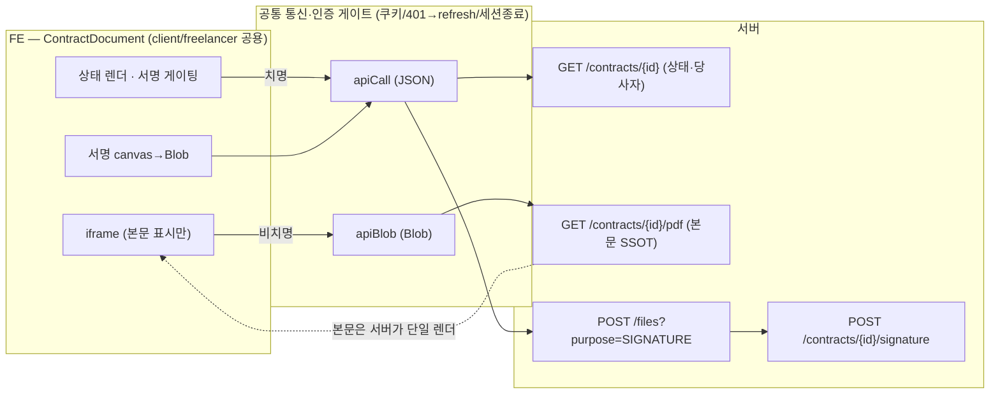
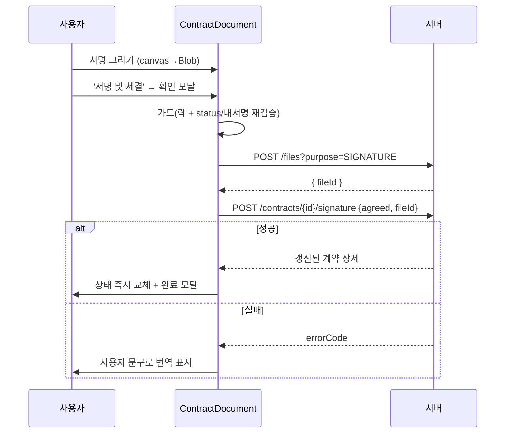

# 계약서 화면 데이터 아키텍처 명세 (도식화용)

> 이 문서는 계약서 화면의 "화면 단위 데이터 설계 책임"을 도식화하기 위한 자체 완결형 명세다.
> 노드/엣지/시퀀스/책임경계를 명시적으로 나눠, 그림 도구가 추측 없이 그릴 수 있게 작성했다.
> 근거 파일: `src/features/contract/components/common/ContractDocument.tsx`, `ContractOverview.tsx`, `src/features/contract/services/contracts.ts`, `src/lib/api.ts`, `src/features/contract/types/contractDetail.ts`

---

## 0. 대상 & 범위

- **화면**: 계약서 서명 화면 (`ContractDocument`) + 계약 상세 화면 (`ContractOverview`)
- **라우트 (역할별 2개가 1컴포넌트 공유)**
  - 서명: `/client/projects/[projectId]/contracts/[contractId]/sign`, `/freelancer/contracts/[contractId]/sign`
  - 상세: `/client/projects/[projectId]/contracts/[contractId]`, `/freelancer/contracts/[contractId]`
- **역할 분기**: `role: "client" | "freelancer"` prop **하나**로 라벨·경로만 분기, 데이터 로직 완전 공용
- **핵심 설계 원칙**: 계약서 **본문 = 서버 PDF 단일 출처(SSOT)**. FE는 상태·서명 상호작용만 책임.

---

## 1. 노드 목록 (다이어그램 박스)

**클라이언트(브라우저) 계층**
- `N1` ContractDocument (React Client Component)
- `N2` 로컬 상태 저장소 (React state: contract / pdfPreviewUrl / signatureBlob …)
- `N3` SignaturePadModal (canvas 서명 입력)
- `N4` 공통 통신 계층 `apiCall` (JSON)
- `N5` 공통 통신 계층 `apiBlob` (바이너리)

**서버(백엔드) 계층**
- `N6` `GET /api/v1/contracts/{id}` — 계약 상세(JSON)
- `N7` `GET /api/v1/contracts/{id}/pdf` — 계약서 PDF(Blob)
- `N8` `POST /api/v1/files?purpose=SIGNATURE` — 서명 이미지 업로드 → fileId
- `N9` `POST /api/v1/contracts/{id}/signature` — 서명 제출 → 갱신된 계약 상세
- `N10` 인증/세션 (쿠키 기반, 토큰 refresh)

---

## 2. 데이터 소스 4종 & 성격 (엣지 라벨용)

| ID | 엔드포인트 | 반환 | 통신계층 | 성격 | 실패 치명도 |
|---|---|---|---|---|---|
| N6 | `GET /contracts/{id}` | 계약 상태·당사자·서명배열·금액 (JSON) | apiCall | **메타/상태** | **치명** (화면 전체 차단) |
| N7 | `GET /contracts/{id}/pdf` | 계약서 본문 PDF (Blob) | apiBlob | **본문(SSOT)** | **비치명** (미리보기 영역만) |
| N8 | `POST /files?purpose=SIGNATURE` | `{ fileId }` | apiCall(multipart) | 서명 업로드 | 서명 흐름 중단 |
| N9 | `POST /contracts/{id}/signature` | 갱신된 계약 상세 (JSON) | apiCall | 서명 확정 | 서명 흐름 중단 |

> 중요 뉘앙스(도식 주석용): 상세 JSON(N6)에는 `clauses[]`(조항 텍스트)가 **포함되어 있지만**, 화면은 이 조항을 렌더링에 쓰지 않고 **본문은 PDF(N7)만** 신뢰한다. → "데이터가 있어도 법적 본문의 출처는 서버 렌더 PDF 하나"라는 SSOT 경계.

---

## 3. 공통 통신 계층 (N4/N5) — 모든 화살표가 통과하는 게이트

두 계층 모두 동일한 인증·복구 로직을 공유:
- `credentials: "include"` — **쿠키 인증** (토큰을 JS가 만지지 않음)
- 응답이 `GLOBAL_009`(액세스 만료)면 → `requestRefresh()` 1회 → **원요청 재시도**
- `GLOBAL_010`(만료)/`GLOBAL_011`(중복 로그인) → `notifySessionEnd()` 전역 세션 종료
- 성공 시 `apiCall`은 `body.data`만 추출 / `apiBlob`은 `response.blob()` 반환

> 도식화: N4/N5를 **하나의 "공통 통신·인증 게이트"** 박스로 묶고, 그 안에 "쿠키 인증 / 401→refresh→재시도 / 세션종료 브로드캐스트" 3개를 표기.

---

## 4. 플로우 A — 화면 진입(로드) 시퀀스

```
[진입/새로고침]
  → N1 mount, isLoading=true
  → 두 요청을 병렬 발사 (서로 의존 없음):
       (A1) N5 apiBlob → N7  GET /contracts/{id}/pdf
       (A2) N4 apiCall → N6  GET /contracts/{id}
  ├─ A1 성공 → Blob → URL.createObjectURL → pdfPreviewUrl 상태
  │           → <iframe src=pdfPreviewUrl#toolbar=0&view=FitH> 렌더
  │   A1 실패 → pdfErrorMessage (미리보기 영역만 에러+재시도, 화면 유지)  ← 비치명
  └─ A2 성공 → contract 상태 → 상태/서명버튼/당사자 렌더
      A2 실패 → errorMessage (화면 전체 차단 + 재시도)                  ← 치명
  → isLoading=false
```

**분기 규칙(도식 조건 노드)**
- `canSign = (contract.status === "SIGN_PENDING") && (내 서명.status === "PENDING")`
- PDF 다운로드 버튼 노출 = `양측 서명 SIGNED` (FE가 서명배열에서 계산)

---

## 5. 플로우 B — 전자서명 제출 시퀀스 (되돌릴 수 없는 액션)

```
[서명 그리기]  N3 canvas → toBlob('image/png') → signatureBlob 상태
[서명 및 체결 클릭] → ConfirmModal("서명 후 취소 불가")
     └ 확인 →  submitSignature()
         ├ 가드1: submitLockRef 잠금(중복 제출 차단)
         ├ 가드2: status/내서명/blob 재검증 (canSign 재확인)
         ├ (B1) N4 apiCall → N8  POST /files?purpose=SIGNATURE (multipart)  → { fileId }
         ├ (B2) N4 apiCall → N9  POST /contracts/{id}/signature { agreed:true, signatureFileId } → 갱신 계약상세
         ├ 성공 → contract/signedContract 상태 즉시 교체(재조회 없음) → 완료 모달
         └ 실패 → 서버 errorCode를 사용자 문구로 번역 표시
                   (INVALID_CONTRACT_STATUS / ALREADY_SIGNED / NOT_CONTRACT_PARTY …)
         finally: submitLockRef 해제
```

**방어 계층(도식 주석)**: 1차 방어 = FE 상태 조합(canSign) + 락, **최종 판정 = 서버 errorCode**. 프론트는 서버 판정을 사용자 언어로 번역만.

---

## 6. 책임 경계 다이어그램 (가장 중요한 그림 — SSOT 경계선)

**경계선 하나를 긋고 좌/우로 나눔:**

| 서버(백엔드)가 책임 | ⟺ 경계 ⟺ | FE(화면)가 책임 |
|---|---|---|
| 계약서 **본문 렌더**(PDF) | | 본문을 **재조립 안 함** (iframe 표시만) |
| 조항 번호·금액·근무장소 정책 | | **상태 판정** (canSign, 다운로드 노출) |
| 서명 유효성 **최종 판정**(errorCode) | | **1차 게이팅** + 중복 제출 방지 |
| 계약 상태·당사자·서명배열 데이터 | | 상태→**한글 라벨 매핑**, 파생 계산(양측서명) |
| — | | 서명 캔버스→Blob→업로드 **인터랙션** |
| — | | Blob URL **메모리 수명 관리**(revoke) |

**한 줄 메시지(그림 제목)**: *"같은 계약서를 두 번 만들지 않는다 — 본문은 서버 PDF 단일 출처, FE는 상태·서명."*

---

## 7. 로컬 상태 목록 (state 다이어그램용, N2 내부)

- `contract` (계약 상세/상태) · `isLoading` · `errorMessage` (치명)
- `pdfPreviewUrl` · `pdfErrorMessage` (비치명, 분리됨)
- `signatureBlob` · `signaturePreviewUrl` (서명 이미지)
- `isSubmitting` · `submitLockRef` (제출 잠금)
- `signedContract` (완료 모달 트리거)

---

## 8. 도식화 요청 시 추천 3장 구성

1. **책임 경계도** (§6) — 서버 vs FE, SSOT 경계선. → *발표 메인 슬라이드*
2. **진입 시퀀스도** (§4) — 병렬 로드 + 치명/비치명 분기.
3. **서명 시퀀스도** (§5) — canvas→file→signature 2단계 + 방어 계층.

---

## 9. Mermaid 초안 (도구가 다듬을 시작점)

**책임 경계 + 데이터 흐름:**


**서명 시퀀스:**


---

## 부록. 검증 메모 (도식에 넣지 말 것)

- `.ai/API.md:767`의 "DRAFT 2초 간격 최대 10회 폴링"은 **현재 코드에 미구현** (`ContractOverview`는 1회 조회). 문서-코드 불일치이므로 도식/발표에 넣지 않는다.
- 근거 라인: PDF Blob→iframe = `ContractDocument.tsx:75, 193-194` / 병렬·치명도 분리 = `:69-91` / 서명 게이팅 = `:167` / 에러 번역 = `:304-311` / 서비스 = `contracts.ts:35, 38-58` / 공통 통신 = `api.ts:120-145`(apiBlob), `:74-117`(apiCall).
